# Enjoy in-app debugging with flutter_ume

[Codelab Feedback](https://github.com/cfug/ume-codelab/issues)


## 介绍
Duration: 20:00


### **为什么要创建 flutter_ume？**

flutter_ume 是一款针对 Flutter 应用开发的应用内调试工具平台。最初是 2020 年 6 月，由字节跳动西瓜视频 Flutter 基础技术团队孵化，经过内部大量 Flutter 开发者的使用及共建，2021 年 7 月开源  [flutter_ume](https://pub.flutter-io.cn/packages/flutter_ume) 社区版本。


#### **应用内调试**

一直以来，Flutter 开发者习惯于在计算机上使用 Flutter DevTools 对 Flutter 应用进行调试。这样做存在一定不便，一旦脱离了计算机，如交付给测试人员/产品经理/设计师的测试版本，开发者想要获取应用运行信息将无从下手。

flutter_ume 及相关调试插件作为 Dart Package 接入到宿主应用中，直接将应用的有用数据暴露给开发人员，甚至可以动态调整应用的运行状态。由此，无需依赖计算机，无需 attach 调试器，一次接入后续可直接使用，直接在应用内完成对程序的诊断。

#### **插件扩展能力**

flutter_ume 代码包本身是一个调试工具平台，不具备调试能力，但社区版提供了十余个功能各异的调试插件；社区中也有一些开发者贡献了一些优质插件。假如这些插件仍然无法满足你的定制化需求，你也可以通过依赖 flutter_ume 提供的基础能力，来创建定制能力的插件。

#### **多平台兼容**

由于 Flutter 是一个跨多平台的自渲染框架，flutter_ume 及其插件也是一个个的 Dart Package，因此 flutter_ume 可以随宿主应用兼容多个平台（因部分功能在各平台上实现有差异，所以无法在所有平台上提供完整的插件功能）。开发者也可根据实际情况，为特定平台开发定制插件。

### **你将构建出什么？**

跟随本 codelab，你将：

* 创建出一个具有简单 UI 的 Flutter App，它包含多个模块的页面
* 在该应用中接入 flutter_ume，并体验如何在应用内调试应用
* 切换至 Release 模式构建应用，模拟测试用途的应用，在 Release 模式下体验调试能力
* 为 flutter_ume 编写一个自定义功能的插件

本 codelab 重点关注 flutter_ume 的接入、使用及自定义插件的编写，对于相关性不大的胶水代码，提供了完整的示例，开发者可根据自己的情况拷贝这些代码。


## 准备工作：配置 Flutter 环境
Duration: 20:00


如果你之前已经在本地运行过 Flutter 应用，你可以跳过本小节。但请尽量确保本地环境与本文推荐环境版本匹配。


请根据自身需要，配置 Flutter 运行平台对应的开发环境。详尽的环境配置文档请见： [https://flutter.cn/docs/get-started/install](https://flutter.cn/docs/get-started/install) 。

### **配置 IDE**

开发 Flutter 应用，官方有两种推荐 IDE：VSCode 与 Android Studio。请根据喜好任选其一。

* VSCode 下载地址： [https://code.visualstudio.com/](https://code.visualstudio.com/)
* Android Studio 下载地址： [https://developer.android.google.cn/](https://developer.android.google.cn/)

#### **VSCode**

在 VSCode 中，左侧边栏选择 Extensions，搜索 "Flutter" 与 "Dart" 并点击 Install 安装。


#### **Android Studio**

在 Android Studio 中，点击菜单中的 Android Studio-Preferences，点击左侧 Plugins，搜索 Flutter，点击 Install，会询问是否安装依赖 Dart，选择 Yes。

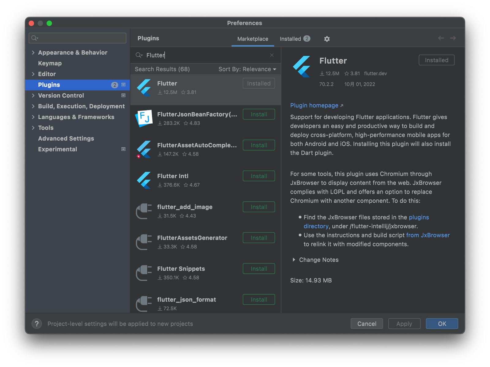

### **安装 Flutter SDK**

在不同平台上安装 Flutter SDK 不尽相同，请根据自身情况安装。

* macOS： [https://flutter.cn/docs/get-started/install/macos](https://flutter.cn/docs/get-started/install/macos) 
* Windows： [https://flutter.cn/docs/get-started/install/windows](https://flutter.cn/docs/get-started/install/windows) 
* Linux： [https://flutter.cn/docs/get-started/install/linux](https://flutter.cn/docs/get-started/install/linux) 

### **配置环境变量**

> aside positive
> 
> **提醒:**  针对大陆网络环境，可以先查阅 [该文档](https://flutter.cn/community/china)，以确定是否需要对网络环境进行设置。

在安装完 Flutter SDK 后，请检查你的环境变量中，是否将 Flutter SDK 的路径配置到 PATH 中，且配置了 `PUB_HOSTED_URL` 以及 `FLUTTER_STORAGE_BASE_URL`。

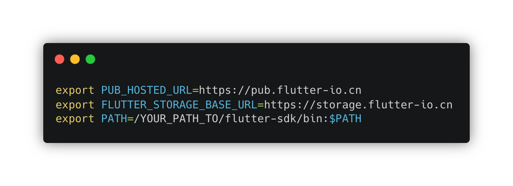

此时，在完成了上述操作后，在终端输入 `flutter doctor`，显示无 error，说明你已经完成了 Flutter 开发环境的配置工作了。


## 编写一个 Flutter App
Duration: 20:00


### **创建 Flutter 工程**

编写 Flutter App 从创建工程开始。

以下是创建工程的步骤：

1. 打开"终端"
2. 执行 `flutter create --platform ios,android,macos demo_app`

* 此处的 `--platform` 参数是你要创建的 Flutter 应用所运行的平台，每一个平台将会对应创建出该平台的应用 "壳工程"。
* demo_app 是你为项目设定的名字，请使用小写字母、数字、下划线的形式命名


### **在模拟器或真实设备上运行应用**

1. 进入项目目录，执行 `cd demo_app`
2. 执行 `flutter devices` 检查当前运行了哪些设备

* 假如没有找到任何设备，请先检查是否连接了真实设备（且开启了开发者模式）或启动了模拟器等


3. 执行 `flutter run -d xx`

* "xx" 是上一步获取的设备标识，在这里请替换为该标识。如图中 iOS 模拟器标识为 FD3F5A68-C2A7-4CDC-B942-6BF90B33908B，本机（macOS 电脑）标识为 macos，本地浏览器（web 平台）标识为 chrome。

4. 在一段时间的等待后，我们会发现相应的设备启动了 Flutter 应用（左图是 macOS 上运行的 Flutter 应用，右图是在 iOS 模拟器上运行的 Flutter 应用）

 

> aside positive
> 
> **提醒：**我们应该能注意到，运行起 Flutter 应用后，在终端上输出了一些内容，大致是说按下某个键可以触发某个开关，在 http://127.0.0.1:xxx/xxx/ 可挂载调试器等。
> 
> 
> 
> 这些调试信息主要告知了可以在当前终端使用的调试快捷键，更多更复杂的调试能力，需要使用 Flutter DevTools，并通过挂载至映射到 127.0.0.1 本机的调试服务上实现。
> 
> 其中 Hot reload 是 Flutter 上大名鼎鼎的 "热重载" 能力，借由此能力，Flutter 具备相当优秀的开发效率。

### **使用 IDE 运行工程**

前文讲述的方式，通过在终端通过命令将 Flutter App 运行起来。对于断点调试、更加丰富的交互形式来说，安装了 Flutter 和 Dart 插件的 IDE 是一个更加强大的工具。因此在本小节，我们将使用 IDE 运行 Flutter App。

#### **使用 VSCode 运行工程**

在 VSCode 中找到工程目录打开。

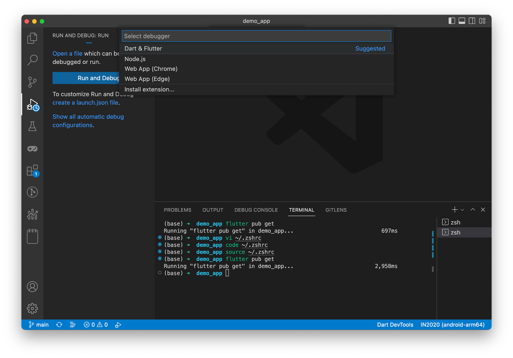

点击左侧的 Run & Debug 选项中，并点击 Run and Debug，选择 Dart & Flutter。

#### **使用 Android Studio 运行工程**

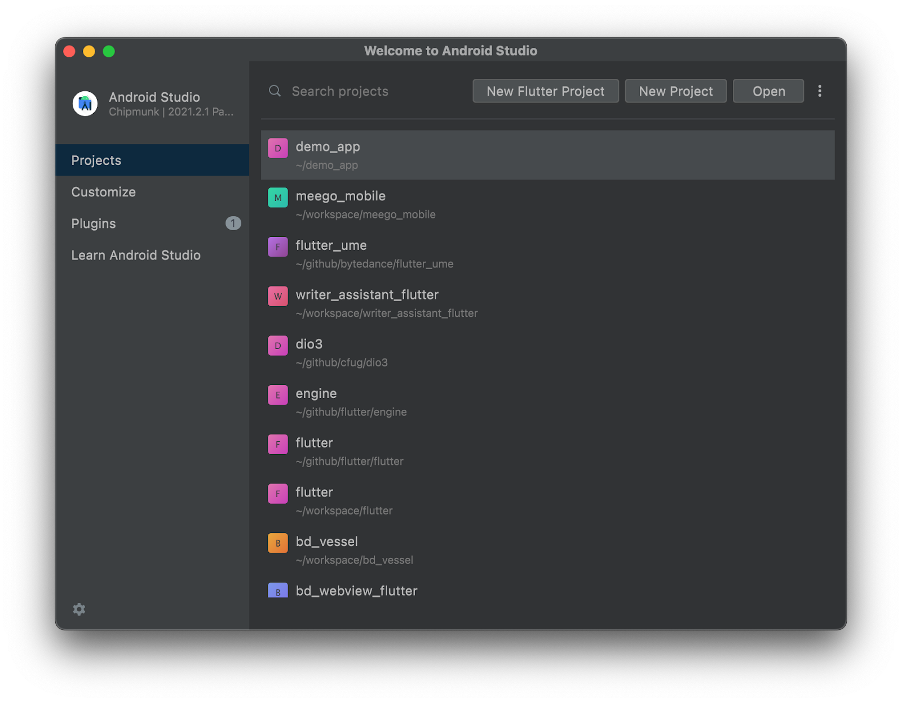

打开 Android Studio，选择 Open，找到项目目录。

> aside positive
> 
> **提醒：**初次打开项目时，Android Studio 会索引项目需要花费一些时间，在 IDE 底部可以查看进度。在索引完成前，代码高亮、补全、跳转等功能可能不可用。
> 
> 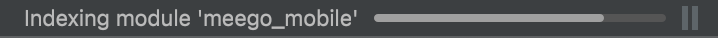


在左侧 Project 窗口中找到 pubspec.yaml，双击打开，在右侧上方 Flutter commands 中选择 Pub get 按钮更新依赖。

完成依赖更新后，在 Android Studio 上方选择要使用的设备，并点击运行按钮。


### **为应用添加自定义功能**

接下来我们为刚刚创建的 demo_app 添加一些代码，后续作为 flutter_ume 的调试示例。你可以自行发挥，代码不必与本小节的内容完全一致。为了加快 Codelab 的速度，你可以直接从这里下载准备好的 Demo 代码示例。

demo_app.1.movie.zip： [https://lf3-static.bytednsdoc.com/obj/eden-cn/clkeh7phrubz/devfest2022/demo_app.1.movie.zip](https://lf3-static.bytednsdoc.com/obj/eden-cn/clkeh7phrubz/devfest2022/demo_app.1.movie.zip)

在压缩包中有三个文件（夹）：assets 用于存放静态资源文件、lib 用于存放代码文件、pubspec.yaml 描述了工程的信息。

我们将压缩包中的代码与资源对应替换新创建的 Demo 工程中的文件。

运行起我们的 Demo 工程，可以看到设备上展示如下图所示。

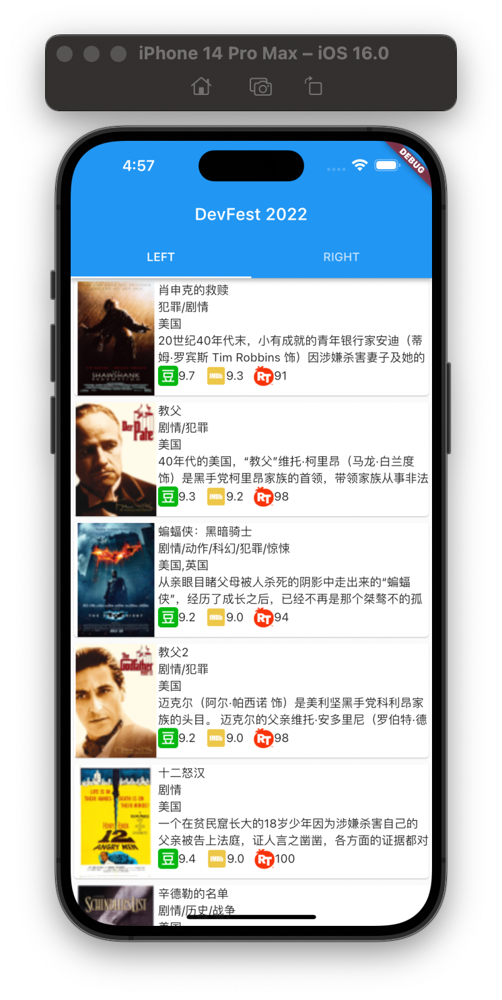


## 接入 flutter_ume
Duration: 10:00


上一节运行起 Demo 工程后你可能会发现，在界面上有 "LEFT" 与 "RIGHT" 两个 Page，它们看起来长得完全一样。但在示例代码中会发现，这两个页面并没有复用同一份代码，而是具有两套代码，以及两种 "结构"。

我们尝试将设备旋转 90 度，会发现 "LEFT" 页面将变为双列样式，但 "RIGHT" 页面仍然为单列样式。


下图为 "left_page.dart" 中的 GridView 与 GridCard。

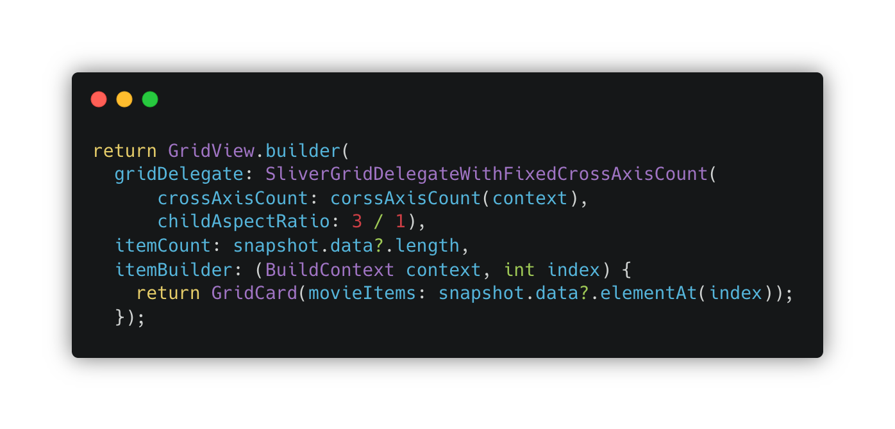

下图为 "right_page.dart" 中的 ListView 与 ListCard。

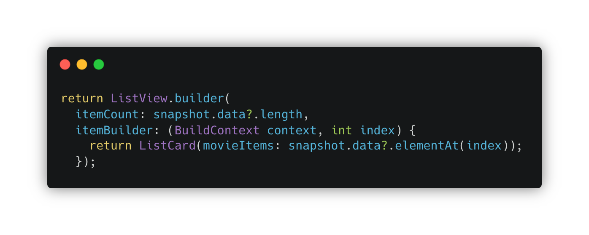

> aside negative
> 
> **思考：**在没有阅读过源代码的情况下，我们有什么方法可以找到 UI 元素上对应的代码呢？

### **接入 flutter_ume 框架**

`pubspec.yaml`

```
dev_dependencies:
  flutter_ume: ^1.1.1+1
```

将正在运行的应用退出。修改 `pubspec.yaml`，在对应位置添加依赖。

在 Demo 工程目录下执行 `flutter pub get`。

`main.dart`

```
import 'package:flutter_ume/flutter_ume.dart';

void main() => runApp(const UMEWidget(child: MyApp()));
```

在 `main.dart` 中引入 flutter_ume 依赖，并修改 `runApp` 方法。

再次运行 Demo 工程，有没有发现此时与刚才有什么不同？


我们可以发现在屏幕右下角多了一个圆形 "Flutter Logo" 按钮。这正是 flutter_ume 的入口。

由于我们在 `pubspec.yaml` 中是以 "`dev_dependencies`" 的形式引入的 flutter_ume，因此在这里我们同样需要修改一点点代码。

`main.dart`

```
void main() {
  if (kDebugMode) {
    runApp(const UMEWidget(
      child: MyApp(),
    ));
  } else {
    runApp(const MyApp());
  }
}
```

至此 UME 就成功接入了应用。

> aside negative
> 
> **思考：**kDebugMode 是如何在 Debug mode 与 Release mode 下返回值不同的？

### **接入调试插件**

可能你发现了，我们刚刚接入的 flutter_ume "按钮" 点开好像什么都没有。接下来我们将调试插件接入到应用中。同样地，在 `pubspec.yaml` 中添加插件依赖。

`pubspec.yaml`

```
dev_dependencies:
  flutter_ume_kit_ui: ^1.0.0
  flutter_ume_kit_console: ^1.0.0
  flutter_ume_kit_show_code: ^1.0.0
  flutter_ume_kit_perf: ^1.0.0
  flutter_ume_kit_device: ^1.0.0

dependency_overrides:
  flutter_ume: ^1.1.1+1
  vm_service: ^9.4.0
```

请注意，由于需要对更广泛的 Flutter 版本支持，需要在 `dependency_overrides` 中，对 vm_service 的依赖版本 override。

在 main.dart 文件中添加对插件包的引用。

`main.dart`

```
import 'package:flutter_ume_kit_ui/flutter_ume_kit_ui.dart';
import 'package:flutter_ume_kit_perf/flutter_ume_kit_perf.dart';
import 'package:flutter_ume_kit_show_code/flutter_ume_kit_show_code.dart';
import 'package:flutter_ume_kit_console/flutter_ume_kit_console.dart';
import 'package:flutter_ume_kit_device/flutter_ume_kit_device.dart';
```

在 main 方法中，添加注册插件的方法。

`main.dart`

```
void main() {
  if (kDebugMode) {
    PluginManager.instance
      ..register(WidgetInfoInspector())
      ..register(WidgetDetailInspector())
      ..register(AlignRuler())
      ..register(ColorPicker())
      ..register(TouchIndicator())
      ..register(Performance())
      ..register(ShowCode())
      ..register(MemoryInfoPage())
      ..register(CpuInfoPage())
      ..register(DeviceInfoPanel())
      ..register(Console());
    runApp(const UMEWidget(
      child: MyApp(),
    ));
  } else {
    runApp(const MyApp());
  }
}
```

退出应用，再次重新执行 `flutter pub get`，并运行工程。


点击屏幕上的圆形 Flutter Logo 按钮，可以看到弹出窗口中已经出现了我们注册的调试插件。

> aside positive
> 
> **提示：**更多社区贡献的调试插件可访问 https://github.com/cfug/flutter_ume_kits

### **使用插件调试应用**

点击插件列表中的 "WidgetInfo" 按钮，并点选屏幕上的组件。

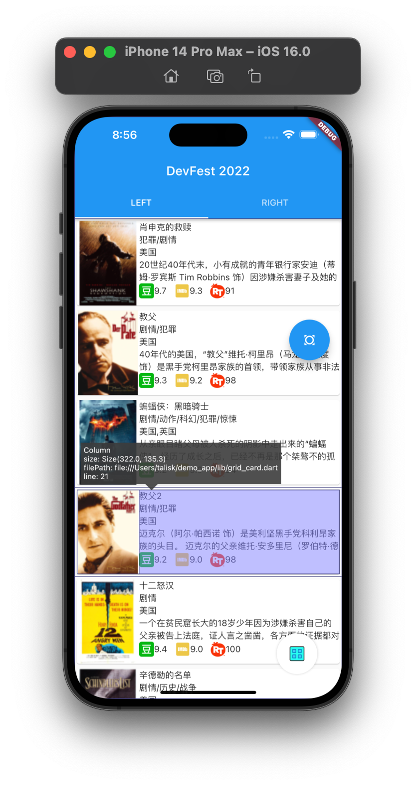 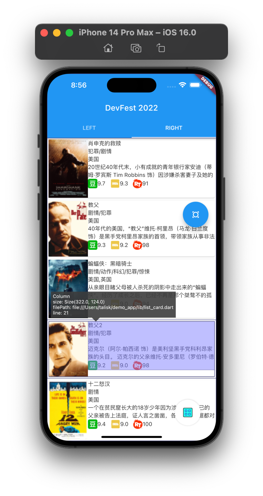

此时可以看到调试界面上出现了这两组 UI 对应的 Widget 所在文件及行号。

回到调试工具目录，选择 ShowCode。

 

在搜索框输入 `package:demo_app/`，在左侧菜单中可以找到当前运行的，本示例工程的所有代码。


## 在 Release mode 中使用 flutter_ume
Duration: 10:00


在前面的步骤中，我们已经成功地在 Debug mode 中接入了 flutter_ume。

但有时候，可能你需要将测试版本交付给产品经理、设计师、测试人员等，以用于验收应用的质量。通常来说，这种测试版本是在 release mode 下构建的，才能获得等同于真实线上用户的体验，确保测试环节的准确性。在这样的条件下，如果有像 flutter_ume 这样的调试工具就再好不过了。好消息是，flutter_ume 可以在 release mode 下使用。仅需一点点小的调整。

在 `pubspec.yaml` 中修改代码，将 flutter_ume 相关的所有依赖从 `dev_dependencies` 里面移动到 `dependencies` 中。

`pubspec.yaml`

```
dependencies:
  flutter_ume: ^1.1.1+1
  flutter_ume_kit_ui: ^1.0.0
  flutter_ume_kit_console: ^1.0.0
  flutter_ume_kit_show_code: ^1.0.0+1
  flutter_ume_kit_perf: ^1.0.0
  flutter_ume_kit_device: ^1.0.0
```

在 main 方法中，将注册插件的代码与 UMEWidget 相关代码从 kDebugMode 的分支中移除。

`main.dart`

```
void main() {
  PluginManager.instance
    ..register(WidgetInfoInspector())
    ..register(WidgetDetailInspector())
    ..register(AlignRuler())
    ..register(ColorPicker())
    ..register(TouchIndicator())
    ..register(Performance())
    ..register(ShowCode())
    ..register(MemoryInfoPage())
    ..register(CpuInfoPage())
    ..register(DeviceInfoPanel())
    ..register(Console());
  runApp(const UMEWidget(
    child: MyApp(),
  ));
}
```

退出应用，执行下 flutter clean，再次重新执行 flutter pub get，使用 release 模式运行工程。

> aside positive
> 
> **提示：**iOS 模拟器设备不支持 release 模式

 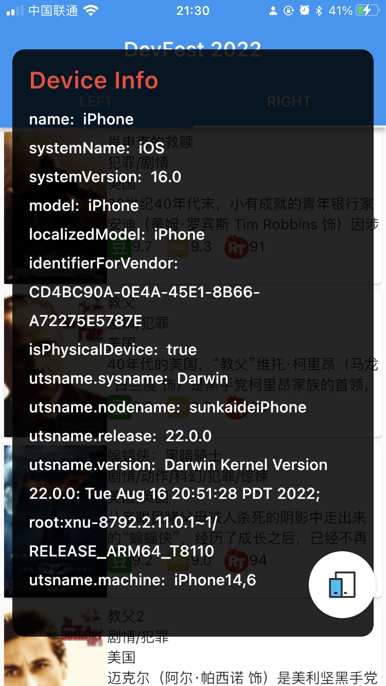

在 Release 模式下，我们仍然获得了一些调试信息。（部分插件功能在 Release 模式下不可用）


## 编写自定义插件
Duration: 20:00


### **创建自定义插件包**

切换到 demo_app 的同级目录，执行 `flutter create -t package custom_kit`。

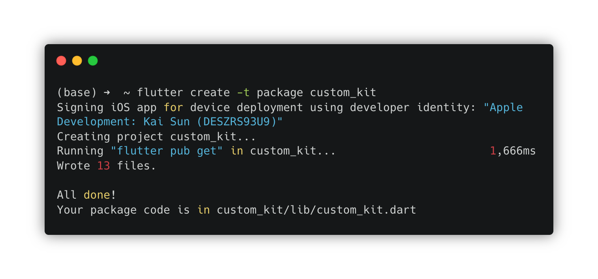

### **编写自定义插件代码**

在 custom_kit 中的 `pubspec.yaml` 中添加对 flutter_ume 的依赖。

`pubspec.yaml`

```
dependency:
  flutter_ume: ^1.1.1
```

打开 custom_kit 工程，编写插件内容。

`custom_kit_panel.dart`

```
library custom_kit;

export 'src/custom_kit_panel.dart';
```

新建目录 src，并创建 custom_kit_panel.dart

`src/custom_kit_panel.dart`

```
class CustomKitPanel {
  
}
```

flutter_ume 为调试工具提供了诸多公开 API，我们自定义的插件可以基于这些 API 构建。引入 flutter_ume 的依赖，并声明实现 Pluggable。

`src/custom_kit_panel.dart`

```
import 'package:flutter_ume/flutter_ume.dart';

class CustomKitPanel implements Pluggable {
  
}
```

此时 Android Studio 或 VSCode 会提示我们 Missing concrete implementations of ... and 1 more. 因为我们声明了 CustomKitPanel 要实现 Pluggable，但未真正有方法对这些方法签名进行实现。


可以利用 Android Studio 或 VSCode 的 Flutter 插件自动提示功能，为我们自动补全缺失的方法实现。

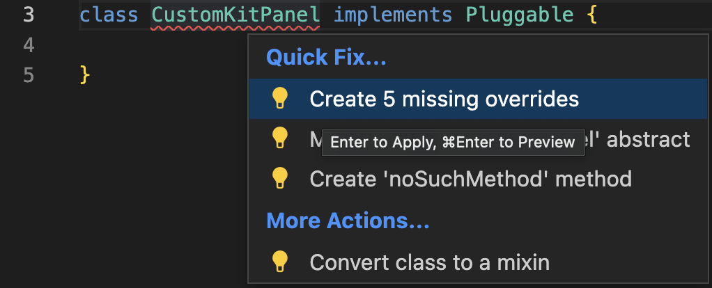

此时，CustomKitPanel 被补充为如下代码：

`src/custom_kit_panel.dart`

```
class CustomKitPanel implements Pluggable {
  @override
  Widget? buildWidget(BuildContext? context) {
    // TODO: implement buildWidget
    throw UnimplementedError();
  }

  @override
  // TODO: implement displayName
  String get displayName => throw UnimplementedError();

  @override
  // TODO: implement iconImageProvider
  ImageProvider<Object> get iconImageProvider => throw UnimplementedError();

  @override
  // TODO: implement name
  String get name => throw UnimplementedError();

  @override
  void onTrigger() {
    // TODO: implement onTrigger
  }
  
}
```

在代码中我们仍然能看到一些 TODO 与 throw UnimplementedError() 需要我们对其进行补充。

* buildWidget 方法用于返回插件的 UI 面板
* displayName 方法用于提供插件展示出来的名字
* iconImageProvider 方法用于提供插件在调试面板上的图标
* name 用于作为插件的唯一标识
* onTrigger 用于调试面板上点按插件图标后的 trigger 行为

`src/custom_kit_panel.dart`

```
import 'package:flutter/material.dart';
import 'package:flutter_ume/flutter_ume.dart';
import 'icon.dart' as icon;

class CustomKitPanel implements Pluggable {
  @override
  Widget buildWidget(BuildContext? context) => Container(
        width: 200,
        height: 200,
        decoration: BoxDecoration(
          borderRadius: BorderRadius.circular(24.0),
          color: Theme.of(context!).backgroundColor,
        ),
        child: Center(child: Text(displayName)),
      );

  @override
  ImageProvider<Object> get iconImageProvider => MemoryImage(icon.iconBytes);

  @override
  String get name => 'CustomKit';

  @override
  String get displayName => 'CustomKit';

  @override
  void onTrigger() {
    debugPrint('onTrigger $displayName');
  }
}
```

### **在 demo_app 引入 custom_kit**

在 pubspec.yaml 中添加对 custom_kit 的声明

`pubspec.yaml`

```
dependencies:
  custom_kit:
    path: ../custom_kit
```

执行 flutter pub get，修改 main.dart 中的代码，引入 custom_kit

`main.dart`

```
import 'package:custom_kit/custom_kit.dart';

void main() {
  PluginManager.instance
    ..register(CustomKitPanel());
}
```

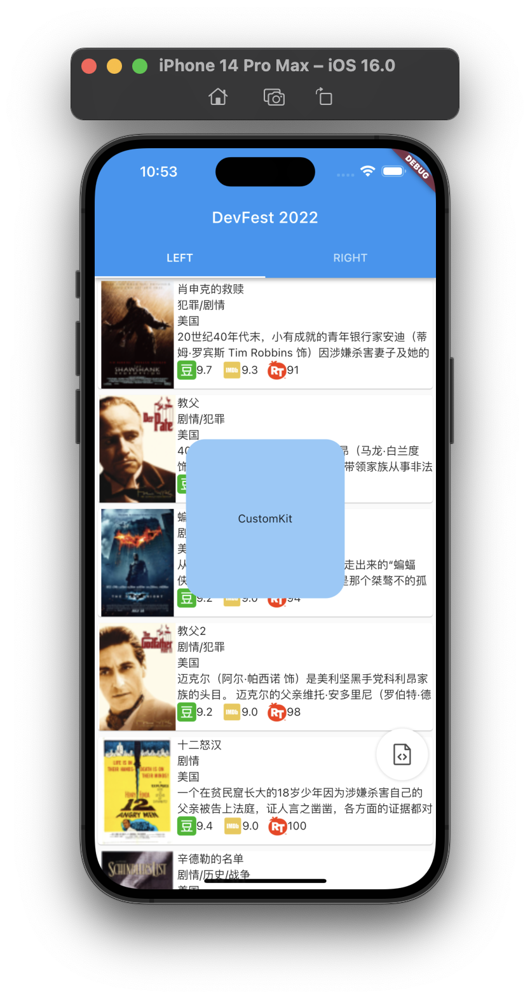

重新运行 Demo App，点击 flutter_ume 面板中的 custom_kit 插件图标，可以看到 CustomKit 的面板已经出现在屏幕上了。

> aside negative
> 
> **思考：**插件都能做些什么有意思的事？


## 向社区发布自定义插件
Duration: 10:00


在完成了以上内容后，可以考虑将你编写的 custom_kit 发布到社区，与其他 flutter_ume 的用户共享这一成果。

发布包之前请使用 `flutter pub login` 命令登录到 pub。

要发布一个 Flutter/Dart 包，可以使用 `flutter pub publish` 命令。请注意，Dart 包的发布，是不可逆行为，因此请慎重。7 天内发布的包，可以被撤回，但 "撤回" 不等同于永久消失，而是被标记为 "撤回状态"。

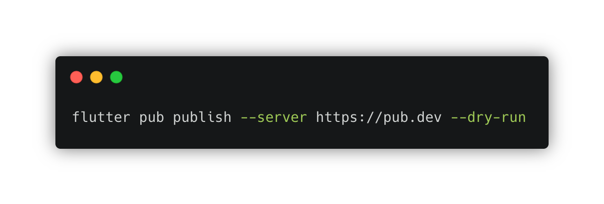

添加 `--dry-run flag` 的目的是用于仅验证包的合法性，而不真正发布包。一般来说用于发布前的最后检查。


如图若有 warning 或 error 都会有相应提示告知开发者，对其做相应整改即可。


## 恭喜完成 codelab
Duration: 05:00


恭喜，你已顺利完成你的 flutter_ume 应用内调试工具的体验之旅！

你创建了一个新工程，将 flutter_ume 接入到其中，体验了 flutter_ume 开发团队提供的调试插件，并亲自动手尝试编写了一个调试插件。这很了不起，未来希望 flutter_ume 能持续为你提供便捷的应用内调试能力，助你提升开发效率。

当然也欢迎你在开发过程中发现痛点，为 flutter_ume 的社区提供更加丰富强大的调试工具；或者为现有的调试工具进行改进，修复问题。

* 由 flutter_ume 开发团队维护的调试工具请见 https://github.com/bytedance/flutter_ume
* 更多来自社区的调试插件解决方案请见 https://github.com/cfug/flutter_ume_kits


